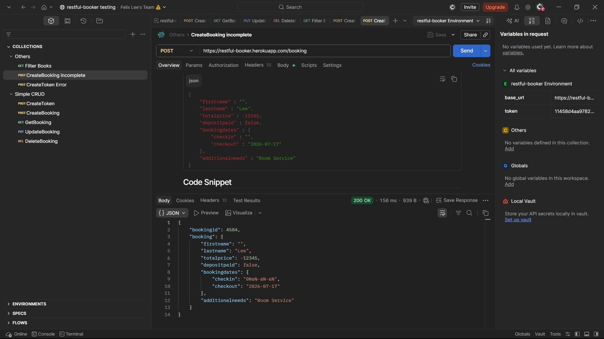

# Relatório de testes da API Restful-Booker

## Introdução

Este relatório é uma análise inicial de qualidade da API acessada em **restful-booker.herokuapp.com**. O relatório está dividido em: 

- **Introdução:** Esta seção descreve como está organizado o relatório.
- **Endpoints:** Esta seção é dedicada a apresentar informações sobre o comportamento específico de cada rota implementada para teste na API, em paralelo à seção de usuários do relatório visual.
- **Melhorias:** Seção que informa sugestões de melhoria para a arquitetura e contrato da API.
- **Vulnerabilidades:** Seção que discorre sobre as vulnerabilidades de segurança e integridade encontradas na API.

### Algumas observações:

- Os casos de teste citados neste documento serão referenciados utilizando seu identificador, composto por **TC-API-<número do teste>**, que podem ser consultados em sua ampla descrição no documento encontrado em `UI-and-API-testing\api-testing\Documentation\API-test-case.md`.
- A validação das funcionalidades e do contrato da API pode ser encontrada no documento de casos de testes, incluindo os fluxos de requisição e resposta (CRUD).

---

## Endpoints

### Rota `/auth` (Autenticação)

- A rota de geração de token demonstrou funcionamento normal ao receber credenciais válidas (`admin`/`password123`), retornando o token de acesso no corpo da resposta como demonstra o caso de teste **TC-API-001**.
- Ao inserir credenciais inválidas, a API retorna uma mensagem descritiva de erro (`"reason": "Bad credentials"`), porém mantém o código HTTP `200 OK`, o que foge ao padrão semântico esperado (como um `401 Unauthorized`), validado no **TC-API-002**.

### Rota `/booking` (GET e POST)

- O endpoint responsável pela criação e listagem de reservas realiza as operações básicas com sucesso. A criação (`POST`) gera um `bookingid` numérico e armazena os dados, validado pelo **TC-API-003**.
- **Comportamento inesperado:** Ao enviar um *payload* (corpo da requisição) JSON omitindo campos obrigatórios (por exemplo, removendo o nó `bookingdates`), a API não trata a validação do contrato adequadamente, retornando um erro genérico `500 Internal Server Error` em vez de detalhar o erro no *client-side* (validado no **TC-API-009**).
- O endpoint permite o envio de tipagens de dados incorretas (ex: envio de *Strings* no campo `totalprice` que deveria aceitar apenas *Numbers*), processando a requisição e salvando no banco de dados sem validação estrita.

### Rotas `/booking/:id` (PUT, PATCH e DELETE)

- As rotas que exigem autorização funcionam adequadamente quando o *header* `Cookie` com o token válido é enviado (casos **TC-API-005** e **TC-API-006**).
- A API bloqueia com sucesso as tentativas de atualização ou exclusão de dados caso o cliente não envie o token de autenticação (Status `403 Forbidden` - **TC-API-008**).
- **Peculiaridade semântica:** Ao realizar a exclusão de uma reserva via método `DELETE`, a API retorna o status `201 Created`. Embora a exclusão seja efetivada no banco de dados de forma correta, o código de status HTTP não corresponde à operação realizada (o padrão de mercado seria um `200 OK`, `202 Accepted` ou `204 No Content`).

---

## Melhorias

### Padronização Semântica de Status HTTP

- A API apresenta diversas inconsistências na devolução de códigos HTTP para o cliente. Recomenda-se refatorar as respostas para que retornem códigos adequados: `401 Unauthorized` para falha de login, `400 Bad Request` para *payloads* malformados ou requisições incompletas, e `204 No Content` para deleções bem-sucedidas. Isso evitará falsos positivos e facilitará integrações futuras com interfaces web e rotinas de automação.

### Validação Estrita de Contrato (Schema Validation)

- A ausência de validação de tipagem no momento do `POST/PUT` permite a inserção de registros com dados faltantes ou sem sentido como os aprensentados na Figura abaixo.

---

## Vulnerabilidades

### Ataque de Força Bruta no Endpoint de Autenticação

- **Vulnerabilidade:** O endpoint `/auth` não possui mecanismo de bloqueio ou restrição após receber múltiplas requisições sequenciais com credenciais erradas.
- **Impacto:** A API fica vulnerável a ataques de força bruta (Brute Force) e preenchimento de credenciais (*Credential Stuffing*), permitindo que um invasor descubra as senhas do sistema através de disparos automatizados contínuos.
- **Solução:** Implementar uma política de *Account Lockout* temporário após X tentativas falhas para um mesmo usuário ou endereço IP.

