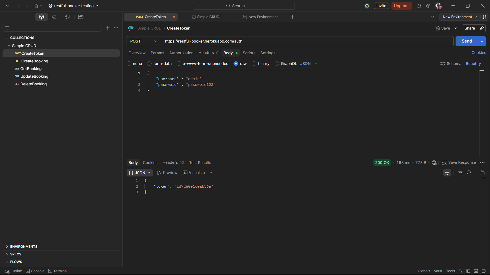
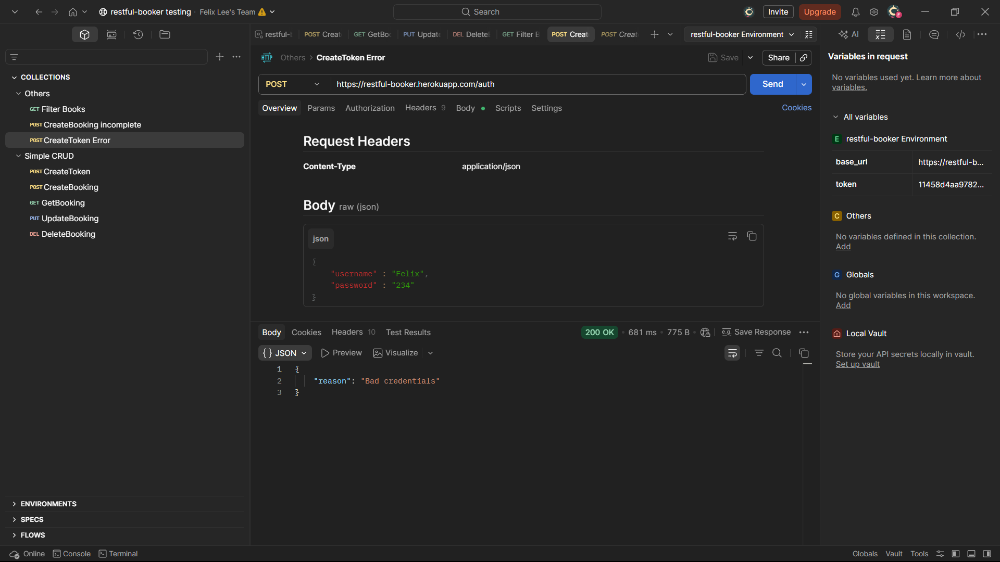
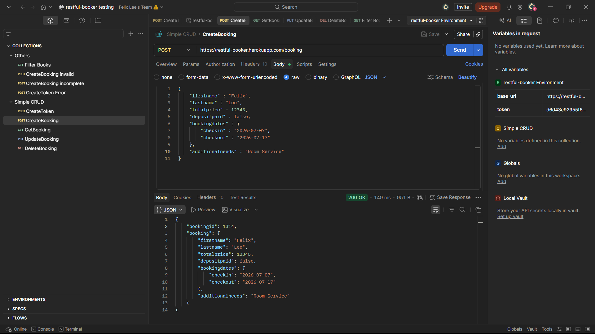
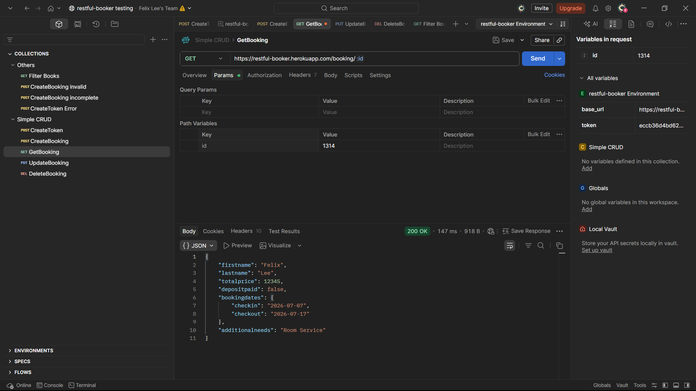
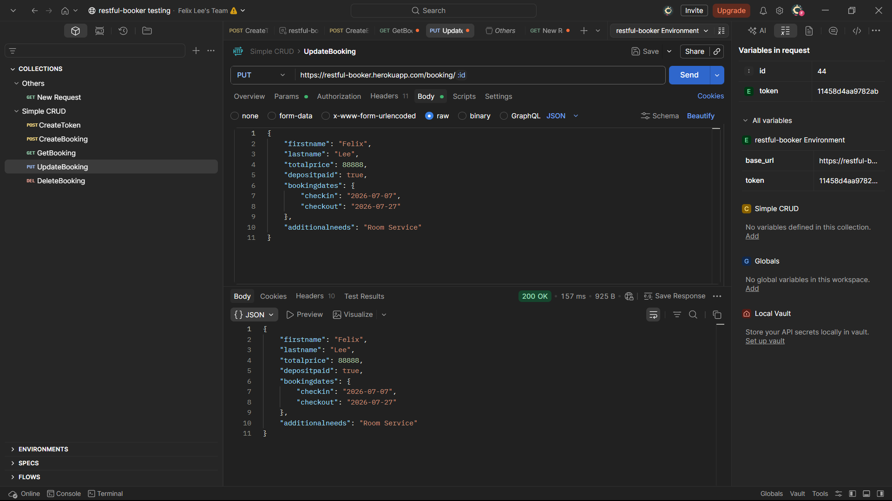
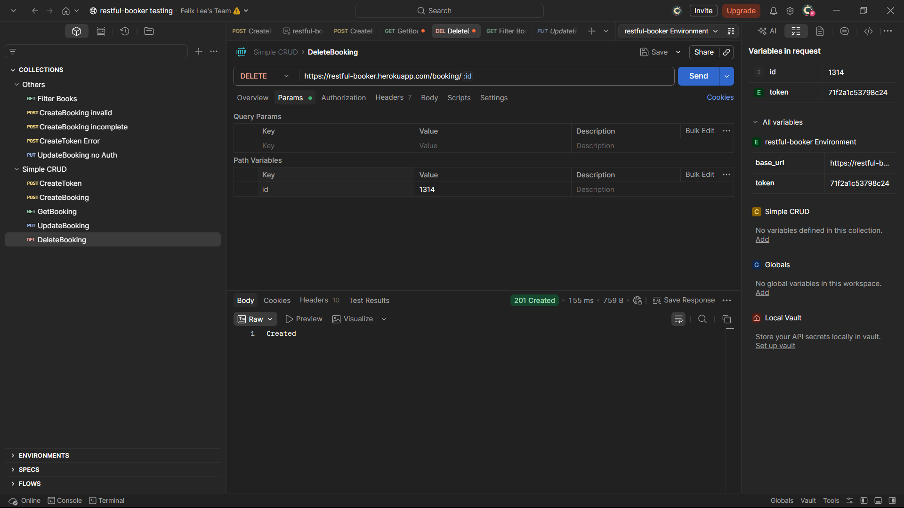
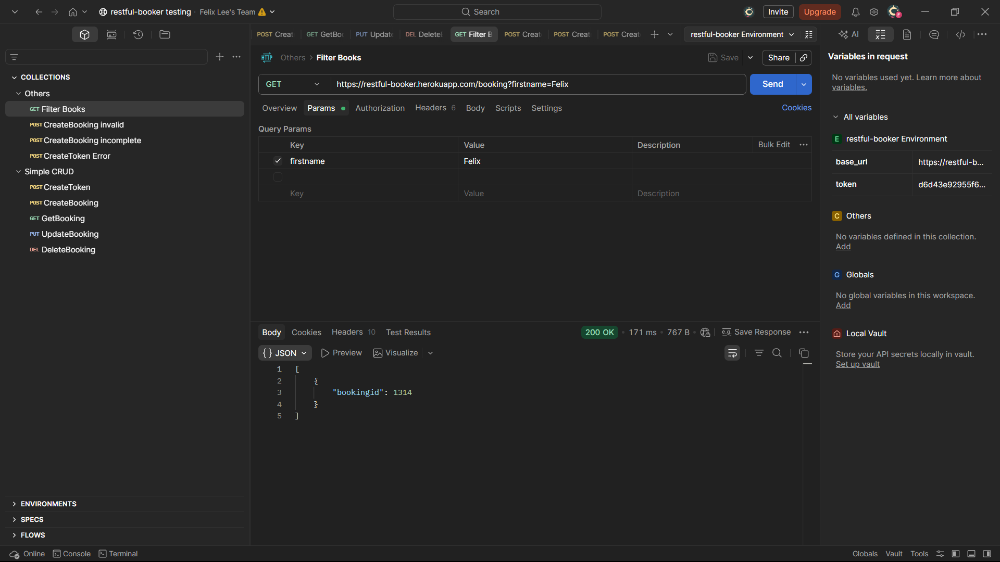
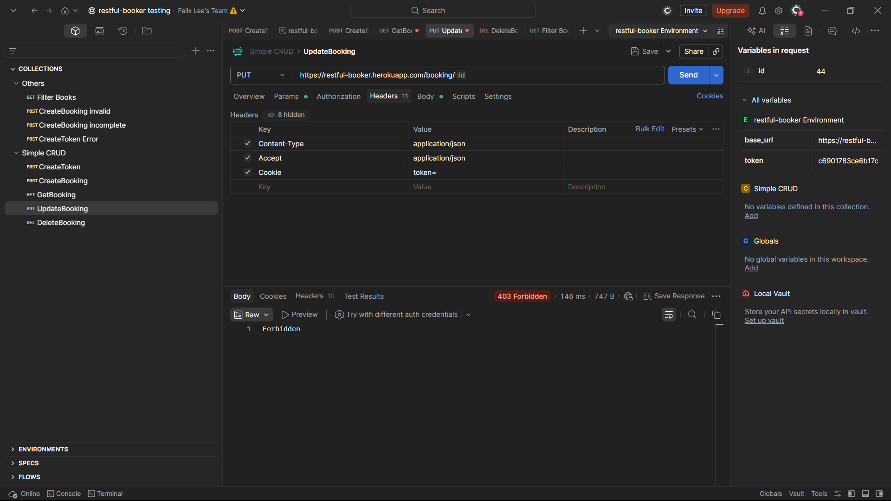
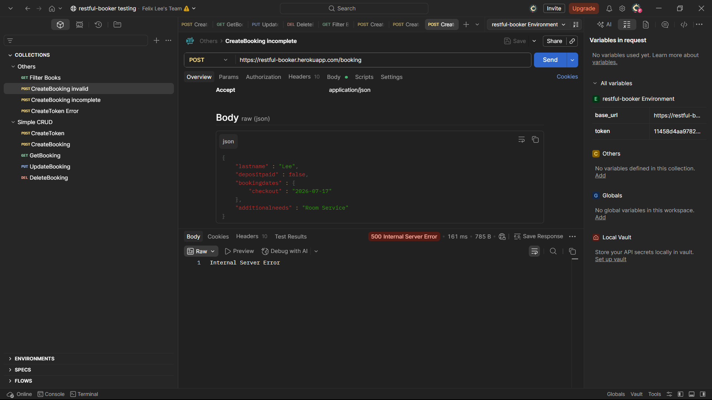

# Plano de Testes API - Restful-Booker

Este documento detalha os casos de teste para a API Restful-Booker, cobrindo os fluxos de autenticação, operações CRUD (Create, Read, Update, Delete) e validações de contrato, conforme estruturado na documentação da API.

---

## 1. Autenticação

### TC-API-001: Gerar Token de Acesso
* **Nome:** Autenticação de Usuário (POST /auth).
* **Objetivo:** Validar a geração de um token de autorização válido para operações restritas.
* **Pré-requisitos:** API online e credenciais válidas (`admin` / `password123`).
* **Ações:**
    1. Enviar requisição POST para o endpoint `/auth`.
    2. Enviar no *Body* (JSON): `{"username": "admin", "password": "password123"}`.
    3. Definir *Header* `Content-Type: application/json`.
* **Resultado:** A API deve retornar Status Code `200 OK` e um corpo JSON contendo a chave `"token"` com uma string alfanumérica.
* **Evidência:** 

### TC-API-002: Falha de Autenticação
* **Nome:** Autenticação com credenciais inválidas.
* **Objetivo:** Garantir que o sistema rejeite tentativas de login com dados incorretos.
* **Pré-requisitos:** API online.
* **Ações:**
    1. Enviar requisição POST para `/auth`.
    2. Enviar no *Body* (JSON) credenciais erradas: `{"username": "Felix", "password": "Lee"}`.
* **Resultado:** A API deve retornar um JSON com a propriedade `"reason": "Bad credentials"` (geralmente acompanhado de Status `200 OK` nesta API específica, o que deve ser anotado como peculiaridade/possível bug semântico).
* **Evidência:** 

---

## 2. Gestão de Reservas (CRUD)

### TC-API-003: Criar Reserva
* **Nome:** Criação de nova reserva (POST /booking).
* **Objetivo:** Validar a inserção de um novo registro de reserva no banco de dados.
* **Pré-requisitos:** API online. *Headers*: `Content-Type: application/json` e `Accept: application/json`.
* **Ações:**
    1. Enviar requisição POST para `/booking`.
    2. Enviar *Body* JSON com os dados completos (firstname, lastname, totalprice, depositpaid, bookingdates, additionalneeds).
* **Resultado:** Status Code `200 OK`. O retorno deve conter o `bookingid` numérico e o espelho dos dados enviados no objeto `booking`.
* **Evidência:** 

### TC-API-004: Buscar Reserva por ID
* **Nome:** Leitura de reserva existente (GET /booking/:id).
* **Objetivo:** Validar o retorno correto dos detalhes de uma reserva específica.
* **Pré-requisitos:** Possuir um `bookingid` válido previamente criado (ex: do TC-API-003).
* **Ações:**
    1. Enviar requisição GET para `/booking/{bookingid}`.
    2. Incluir *Header* `Accept: application/json`.
* **Resultado:** Status Code `200 OK`. O corpo da resposta deve conter os dados exatos da reserva correspondente ao ID.
* **Evidência:** 

### TC-API-005: Atualizar Reserva (Completa)
* **Nome:** Atualização integral da reserva (PUT /booking/:id).
* **Objetivo:** Validar a alteração completa de um registro existente.
* **Pré-requisitos:** Possuir um `bookingid` válido e um Token de autenticação (do TC-API-001).
* **Ações:**
    1. Enviar requisição PUT para `/booking/{bookingid}`.
    2. Enviar *Headers*: `Content-Type: application/json`, `Accept: application/json` e `Cookie: token={token_gerado}`.
    3. Enviar *Body* JSON com novos valores para os campos obrigatórios.
* **Resultado:** Status Code `200 OK`. A resposta deve refletir as alterações enviadas no payload.
* **Evidência:** 

### TC-API-006: Deletar Reserva
* **Nome:** Exclusão de registro (DELETE /booking/:id).
* **Objetivo:** Validar a capacidade de remover uma reserva do sistema.
* **Pré-requisitos:** Possuir um `bookingid` válido e Token de autenticação.
* **Ações:**
    1. Enviar requisição DELETE para `/booking/{bookingid}`.
    2. Enviar *Headers*: `Content-Type: application/json` e `Cookie: token={token_gerado}`.
* **Resultado:** Status Code `201 Created` (Peculiaridade semântica do Restful-Booker para exclusão).
* **Evidência:** 

### TC-API-007: Buscar Reserva por Nome (Query Parameter)
* **Nome:** Filtrar reservas por firstname (GET /booking?firstname=:firstname).
* **Objetivo:** Validar a funcionalidade de filtro de pesquisa da API utilizando parâmetros de URL.
* **Pré-requisitos:** API online e possuir uma reserva previamente cadastrada com um nome específico (ex: `firstname` = "Jim").
* **Ações:**
    1. Enviar requisição GET para o endpoint `/booking?firstname=Jim`.
    2. Incluir *Header* `Accept: application/json`.
* **Resultado:** Status Code `200 OK`. A resposta deve conter um array (lista) com um ou mais objetos contendo a chave `"bookingid"`, correspondentes apenas às reservas que possuem o nome pesquisado.
* **Evidência:** 

---

## 3. Validações e Tratamento de Erros

### TC-API-008: Validação de Segurança - Atualização sem Token
* **Nome:** Tentativa de atualização sem autorização (PUT /booking/:id).
* **Objetivo:** Garantir que endpoints protegidos exijam o token de sessão válido.
* **Pré-requisitos:** Possuir um `bookingid` válido.
* **Ações:**
    1. Enviar requisição PUT para `/booking/{bookingid}` com um payload JSON válido.
    2. **NÃO** enviar o Header `Cookie: token=...` ou `Authorization`.
* **Resultado:** Status Code `403 Forbidden`. A reserva não deve ser alterada.
* **Evidência:** 

### TC-API-009: Validação de Contrato - Criação com Dados Incompletos
* **Nome:** Tentativa de criar reserva sem campos obrigatórios (POST /booking).
* **Objetivo:** Validar o tratamento de payload malformado ou incompleto.
* **Pré-requisitos:** API online.
* **Ações:**
    1. Enviar requisição POST para `/booking`.
    2. Enviar *Body* JSON faltando parâmetros cruciais (ex: omitir o nó `bookingdates`).
* **Resultado:** Status Code `500 Internal Server Error` (O Restful-Booker costuma estourar erro 500 nesta situação, o que deve ser reportado como sugestão de melhoria para retornar um `400 Bad Request`).
* **Evidência:** 
