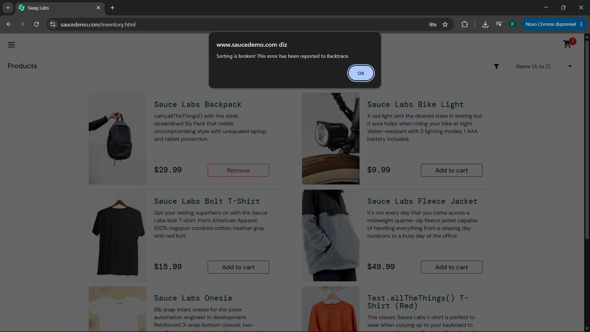
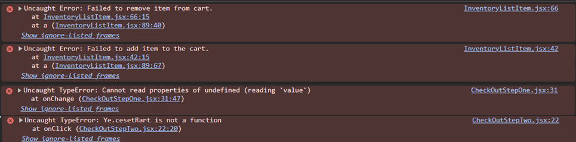
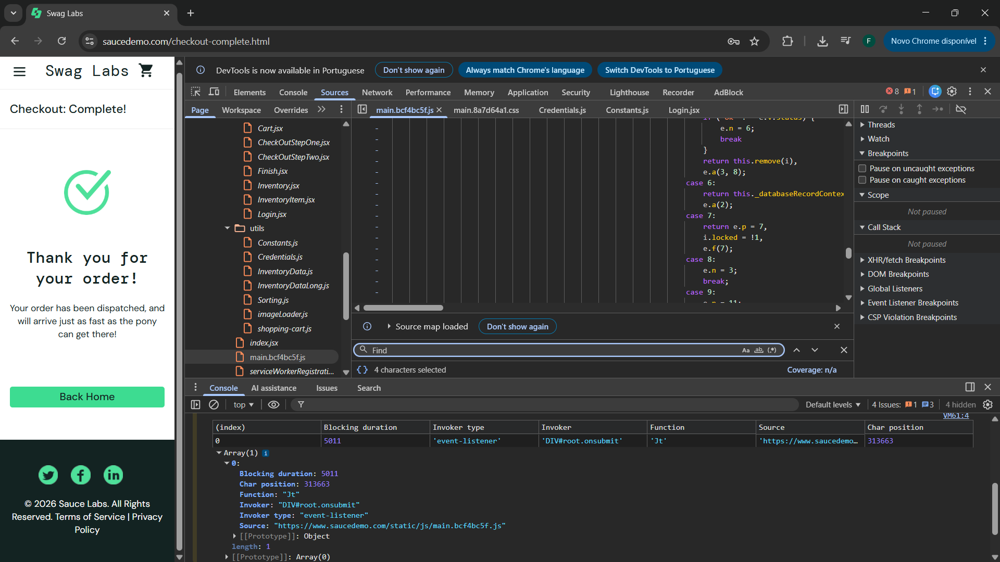
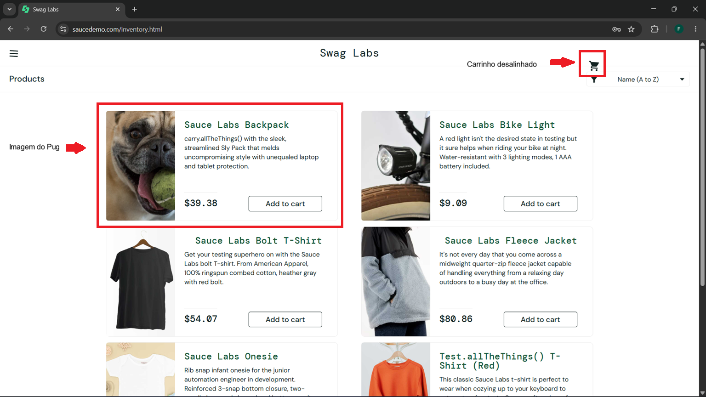
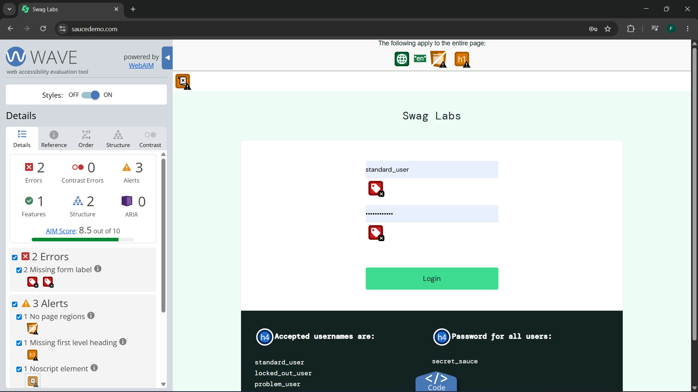
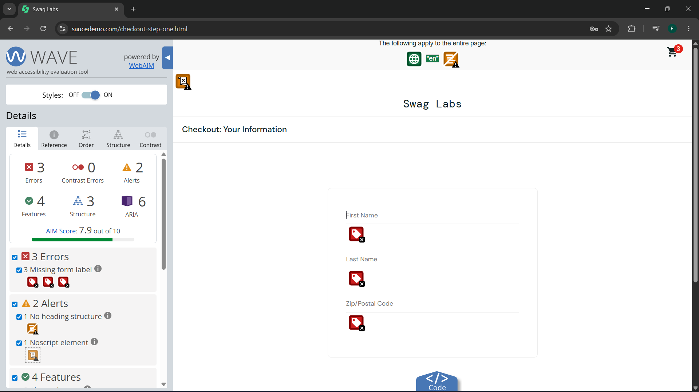

# Relatório de testes da interface de usuário saucedemo

## Introdução

Este relatório é uma análise inicial de qualidade da interface acessada em **saucedemo.com**. O relatório está dividido em: 

- **Introdução:** Esta seção descreve como esta organizado o relatório permitindo.
- **Usuários:** Esta seção é dedicada a apresentar informações sobre as características específicas de cada usuário implementado para teste na interface. 
- **Melhorias:** Seção que informa sugestões de melhoria para a interface.
- **Vulnerabilidades:** Seção que discorre sobre as vulnerabilidades encontradas na interface.

### Algumas observações:

- Os casos de teste citados neste documento serão citados utilizando seu identificador, composto por **TC-<número do teste>**, que podem ser consultados em sua ampla descrição no documento encontrado em `UI-and-API-testing\ui-testing\Documentation\UI-test-case.md` .

- A validação das funcionalidades do software pode ser encontrada no documento de caso de testes incluindo o fluxo normal 

---

## Usuários 

### Usuário `standard_user`

- O usuário `standard_user` apresentou o funcionamento normal da interface, as observações pontuadas nos itens "Melhorias" e "Vulnerabilidades" se aplicam principalmente a este usuário visto que os outros usuários foram construídos propositalmente com falhas como descrito nos itens abaixo. com exceção dos casos de teste *TC-* todos os casos de teste foram realizados utilizando este usuário.

### Usuário `locked_out_user`

- O usuário `locked_out_user` demonstrou-se inoperante, ao realizar uma tentativa de *login* com as credenciais desse usuário a interface apresentou uma mensagem de erro como demonstra o caso de teste **TC-002**

### Usuário `problem_user`

- O usuário `problem_user` não realiza algumas das funções validadas utilizando o usuário `standard_user` sendo elas:
    1. A funcionalidade de ordenação através da funcionalidade de filtro validada pelo **TTC-017** não realiza mudanças na alteração na ordenação dos produtos como pode ser visto no video abaixo:
    <video src="../Evidences/Videos/video-aux-problem-user.mp4" controls></video>
    2. As imagens dos produtos foram substituídas pela seguinte imagem:
    

    3. adição de itens ao carrinho e remoção de itens utilizando o botão na página `https://www.saucedemo.com/inventory.html`.
     Os itens que uma vez incluídos no carrinho não podem ser removidos são:

    - Sauce Labs Backpack
    - Sauce Labs Bolt T-Shirt
    - Sauce Labs Onesie

    Os demais itens não podem ser adicionados ao carrinho.

    4. A navegação ao clicar nos produtos na página `https://www.saucedemo.com/inventory.html` o usuário é levado a itens não correspondentes aos itens selecionados. Especificamente o item **Sauce Labs Fleece Jacket** leva a um item que quando adicionado faz com que o carrinho de compras não carregue como demonstra o video abaixo.
    <video src="../Evidences/Videos/video-aux-problem-user.mp4" controls></video>

    5. o *input* de valores no campo **Last Name** na página `https://www.saucedemo.com/checkout-step-one.html`.

### Usuário `error_user`

- O usuário `error_user` possui falhas semelhantes as falhas do `problem_user` não podendo utilizar a ferramenta de filtro, remover ou adicionar ao carrinho os mesmos produtos que o problem user e não podendo adicionar valores ao campo de *input* Last Name. Diferentemente do usuário `problem-user` o `error_user` permite que o usuário acesse o segundo passo do *checkout* porem não permite que o usuário finalize a compra. 
- Todos os erros citados acima imprimem erros no console como demonstram as Figuras abaixo.

### Usuário `performance_glitch_user`

- O usuário `performance_glitch_user` apresentou uma espera de 5 segundos para o carregamento do inventário de compras como demonstra a Figura abaixo.

### Usuário `visual_user`\

- O usuário  `visual_user` possui apenas erros visuais indicados nas Figuras abaixo:

**Nota:** Em todos os usuários o item **Sauce Labs Backpack** possui em sua descrição o método `carry.allTheThings()` e o produto `Test.allTheThings() T-Shirt (Red)` possui um método em seu nome.

---

## Melhorias

### Acessibilidade

- Ao realizar uma análise utilizando a extensão de navegador Wave podemos notar que a página não rotula os campos de nome de usuário, senha, primeiro nome, sobrenome e código postal como campos de *input* podendo dificultar a identificação destes campos para softwares acessibilidade para pessoas com deficiências visuais.

### Carrinho 

- Ao manter itens no carrinho e trocar de usuário a interface não limpa o carrinho mantendo os produtos selecionados de uma página para a outra. Refatorando o código da interface seria possível criar objetos para cada usuário que mantém os dados de cada item do carrinho adicionado pelo usuário.

---

## Vulnerabilidades

### Ataque de força bruta

- **Vulnerabilidade:** O dispositivo não bloqueia novas tentativas após diversos erros de credenciais

- **Impacto:** O dispositivo fica vulnerável a ataques de força bruta. 

- **Solução:**  Implementação de uma api que não responde a credenciais de login durante um determinado tempo (30 minutos por exemplo) a cada vez que o usuário realizar tres tentativas com credenciais erradas. 

### Fluxo de compra

- **Vulnerabilidade:** Ao realizar o processo de compra, é possível que um usuário mal-intencionado através do resultado do TC-015 realize múltiplas requisições de compra vazias para o servidor. 

- **Impacto:** A vulnerabilidade pode levar a um ataque de negação de serviço (DoS) ou a um esgotamento de recursos do sistema. Essa vulnerabilidade pode levar a perdas financeiras para a empresa, além de comprometer a confiança dos clientes no sistema de compras.

- **Solução:** Implementar verificação de conteúdo válido para as requisições de compra, garantindo que apenas requisições legítimas sejam processadas. Além disso, implementar mecanismos de rate limiting para evitar múltiplas requisições em um curto período de tempo.
